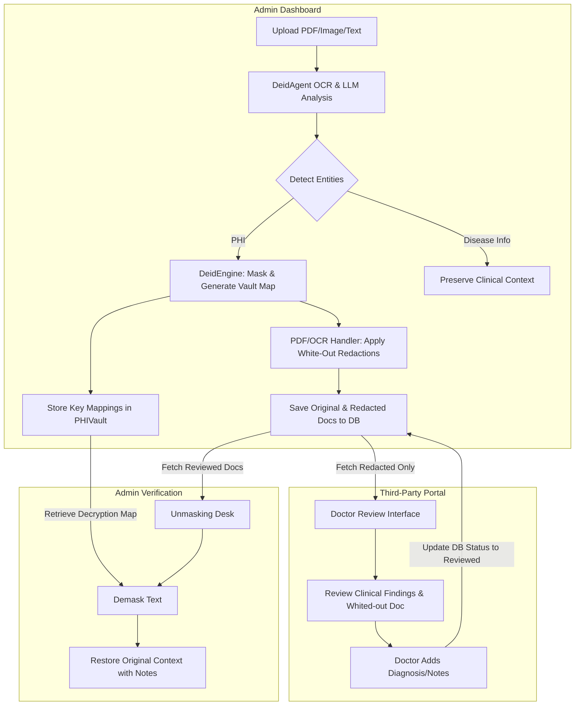

# 🏥 Healthcare Data De-Identification Engine: Project Overview

An AI-powered system designed to identify and redact Protected Health Information (PHI) from medical documents, ensuring HIPAA compliance while preserving clinical context.

---

## 🏗️ System Architecture

The following diagram illustrates the flow of data through the system, from the initial document upload by an Admin to the secure doctor review and final de-masking process.

---

## 🗂️ Core Components Reference

The project is structured into three main modules: the presentation layer, the detection/de-identification engine, and the utility handlers.

### 1. Presentation Layer
*   **[app.py](file:///d:/majorproo/major%20project/app.py)**: The entry point of the application built with **Streamlit**. It implements a dual-role portal:
    *   **Admin Secure Sharing & Upload Portal**: Handles file uploads (TXT, PDF, PNG, JPG), triggers the extraction/redaction pipeline, registers new documents in the vault, and performs final unmasking.
    *   **Third-Party / Doctor Portal**: Displays redacted documents, extracted clinical findings (without PHI), and permits doctors to submit clinical reviews.

### 2. De-Identification Engine (`engine/`)
*   **[deid.py](file:///d:/majorproo/major%20project/engine/deid.py)**: Contains the `DeidEngine` class which manages entity merging to prevent overlapping redact blocks and applies synthetic placeholder masking (e.g. `[PERSON_REDACTED]`).
*   **[context.py](file:///d:/majorproo/major%20project/engine/context.py)**: Contains the `ContextPreserver` class. It defines regular expressions and whitelists (e.g. dosages like `50mg`, blood pressure like `120/80 mmHg`, lab values like `Hb 12`, relative dates like `3 days ago`) to ensure critical clinical information is **never** redacted.
*   **[vault.py](file:///d:/majorproo/major%20project/engine/vault.py)**: Implements `PHIVault`, which handles loading, mapping, and saving document keys (`phi_vault.json`) to allow reversible de-masking of PHI tokens.

### 3. AI Agents (`agents/`)
*   **[deid_agent.py](file:///d:/majorproo/major%20project/agents/deid_agent.py)**: Outlines `DeidAgent` using **LangChain** and **Google Gemini 2.5 Flash** (or OpenAI `gpt-4o`). It includes:
    *   `run_deid`: Text-based structured JSON extraction.
    *   `run_multimodal_deid`: Extract text and normalized bounding boxes (`box_2d` coordinate arrays) from images and PDFs for visual redaction.
    *   *Rate-limit handling*: Automatically retries and falls back to a simulated mock mode if the API quota is hit.

### 4. Utilities (`utils/`)
*   **[pdf_handler.py](file:///d:/majorproo/major%20project/utils/pdf_handler.py)**: Utilizes **PyMuPDF (fitz)** to extract text directly from PDFs and draw visual white-out boxes over PHI.
*   **[ocr_handler.py](file:///d:/majorproo/major%20project/utils/ocr_handler.py)**: Uses **OpenCV (cv2)** to:
    *   Apply visual white-out masks to images based on coordinates.
    *   Generate clean clinical images of extracted disease data.
    *   Crop and stitch clinical segments together (`crop_to_clinical_sections`) for enhanced privacy.
*   **[db_handler.py](file:///d:/majorproo/major%20project/utils/db_handler.py)**: Implements `DBHandler`, which handles storage/retrieval of masked records, original files (base64-encoded for Admin), doctor notes, and statuses in `shared_db.json`.

---

## 🔄 Key Workflows

### 1. File Upload and Redaction (Admin)
1. Admin uploads a medical report.
2. If text, `DeidAgent` runs text extraction. If PDF/Image, multimodal LLM extracts text and spatial bounds (`box_2d`).
3. Extracted items are passed through the `ContextPreserver` to filter out non-sensitive medical measurements.
4. `DeidEngine` replaces PHI with placeholders and registers the true values in `PHIVault`.
5. Visual redaction is applied (white-out boxes) on the PDF or image using `pdf_handler` or `ocr_handler`.
6. Redacted files are uploaded to `shared_db.json`.

### 2. Third-Party Review (Doctor)
1. Doctor logs into the Third-Party Portal.
2. The UI fetches documents from the database with status `Pending Review`.
3. Only the redacted/whited-out file and the pure extracted clinical disease metrics are shown. No PHI is accessible.
4. Doctor enters clinical updates/diagnosis and hits **Submit**.
5. Status changes to `Reviewed`, and doctor comments are attached.

### 3. Reversible De-masking (Admin)
1. Admin opens the **Review** tab in their Dashboard.
2. Selects a reviewed document to examine doctor notes.
3. Clicks **Fully Demask Output** to run placeholders through the vault mapping, restoring the original patient names, dates, and locations inside the updated text.

---

## 🛠️ Technology Stack

*   **Front-End / App Framework**: Streamlit
*   **AI Framework**: LangChain (Google Generative AI, Gemini 2.5 Flash, OpenAI)
*   **PDF Manipulation**: PyMuPDF (`fitz`)
*   **Image Processing**: OpenCV (`cv2`, `numpy`)
*   **NLP & Mock Data**: SpaCy (`en_core_web_sm`), Faker
*   **Local DB**: JSON-based key-value store (`shared_db.json`, `phi_vault.json`)
