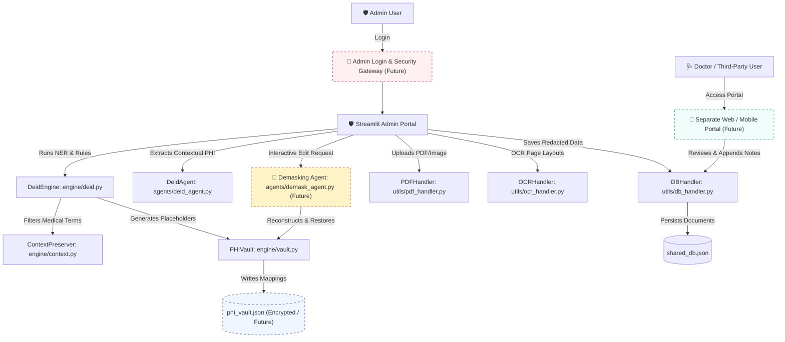

# 🛡️ Healthcare Data De-Identification Engine: Technical Specification & System Design

## 1. Project Abstract
The **Healthcare Data De-Identification Engine** is an enterprise-grade, privacy-first software system designed to identify, redact, and manage Protected Health Information (PHI) from unstructured clinical documents. It ensures strict **HIPAA** and **GDPR** compliance while maintaining the clinical utility of the documentation for secondary research, doctor reviews, and machine learning training. 

By employing a **hybrid detection paradigm** that combines local Natural Language Processing (NLP) with state-of-the-art Multimodal AI, the engine balances high-speed deterministic masking with contextual, visual-spatial reasoning.

---

## 2. Key System Features
*   **Hybrid Detection Pipeline:** Uses a dual-stage pipeline containing local SpaCy NER (for fast, local text processing) and Gemini 2.5 Flash (via LangChain) for visual/scanned OCR and complex contextual reasoning.
*   **Context Preservation:** Employs rule-based filters and whitelists to prevent the accidental redaction of critical medical metrics (e.g., dosages, blood pressure, lab values, disease terminology).
*   **Reversible Redaction & Vault Mapping:** Uses a secure, isolated admin vault (`phi_vault.json`) that maps synthetic redaction placeholders back to original values, allowing authorized admins to fully restore/demask documents.
*   **Multi-format PDF & Image Processing:** Supports raw text files (`.txt`), digital text PDFs, scanned image PDFs, and medical scans/images (`.png`, `.jpg`, `.jpeg`) with coordinate-level pixel blackouts.
*   **Role-Based Access Control (RBAC):** Separates user flows into the **Admin Portal** (full control, uploads, unmasking) and the **Doctor/Third-Party Portal** (accesses redacted clinical summaries, adds diagnostic reviews, zero PHI exposure).
*   **[PLANNED] Editable Demasking Agent:** A dedicated agent designed to reconstruct clinical documents into a fully editable format, allowing context-aware interactive restoration of patient details.
*   **[PLANNED] Decoupled External Portal:** Transitioning the Doctor/Third-Party interface into a standalone external web/mobile application to completely isolate internal database services.
*   **[PLANNED] Admin Authentication & Security Gateway:** Implementing a secure authentication mechanism and database-level encryption to safeguard patient identity records.

---

## 3. System Architecture & Component Interaction
The system is built on a clean, modular architecture, splitting concerns between UI representation, processing engines, and AI agents.

### A. Visual Architecture Design


---

### B. Logical Components & Interactions (Mermaid)


---

## 4. End-to-End Execution Workflow

### Step 1: Upload & Digitization
1. The **Admin** logs in via the **Security Gateway** (Future).
2. The Admin uploads a document (e.g., a scanned PDF report).
3. The `PDFHandler` parses digital text. If the PDF is scanned (no extractable text), `OCRHandler` enhances the document.
4. The raw file is sent to the `DeidAgent` where a multimodal model (Gemini 2.5 Flash) performs OCR and extracts coordinates (`box_2d`) for sensitive fields.

### Step 2: Identification & Filtering
1. The engine scans the text using regexes and local NLP models for high-confidence entities (Names, Emails, Dates).
2. The `ContextPreserver` checks detected entities against a whitelist of medical conditions (e.g., "hypertension") and measurement patterns (e.g., "50mg") to ensure clinical research context remains untouched.

### Step 3: Redaction & Storage
1. The text is masked with synthetic placeholding tokens (e.g., `[PERSON_REDACTED]`).
2. The mapping between placeholders and real names is sent to the `PHIVault` and stored in the secure database (`phi_vault.json`).
3. The redacted text, along with a whited-out version of the image (generated by `OCRHandler`), is stored in the public database (`shared_db.json`).

### Step 4: Medical Review (Decoupled Flow)
1. A **Doctor** accesses the system via a **Separate Web/Mobile Application** (Future). They can see the redacted text and clinical findings, but all names and identifiers are whited out.
2. The Doctor appends clinical comments/notes and submits them.

### Step 5: Demasking & Editing
1. The Admin reviews the Doctor's comments.
2. The Admin triggers the **Demasking Agent** (Future) to reconstruct the clinical record. The agent reads the text and pulls the mappings from the vault, generating an editable document where name tokens can be changed or approved.

---

## 5. Technical Codebase Breakdown

### A. Core Frontend (`app.py`)
Provides the Streamlit interface, routing, and user state.
*   **Authentication & Access Control:** Uses Streamlit sidebar radio buttons to switch between "🛡️ Admin Dashboard" and "🩺 Third-Party / Doctor Portal". *Note: Will be separated in the future.*
*   **Document Upload Tab:** Handles file reading, displays original/redacted preview screens, and triggers the OCR handlers.
*   **Doctor Review Tab:** Displays list of documents needing review, embeds redacted attachments, and logs comments back to the DB.
*   **Admin Unmasking Tab:** Restores PHI for reviewed documents using the secure vault mapping.

### B. NLP & Masking Engines (`engine/`)
*   **[deid.py](file:///d:/majorproo/major%20project/engine/deid.py):** Contains the `DeidEngine` class. Implements SpaCy loader, defines regexes for standard patterns (SSNs, emails, phone numbers, ages), merges overlapping entity spans, and performs text replacement using standardized synthetic tokens.
*   **[context.py](file:///d:/majorproo/major%20project/engine/context.py):** Contains the `ContextPreserver` class. Holds patterns for units/measurements (mg, mmHg, lab results) and checks entities against a medical whitelist to filter out false-positives.
*   **[vault.py](file:///d:/majorproo/major%20project/engine/vault.py):** Contains the `PHIVault` class. Manages the JSON flat-file containing mappings from synthetic placeholders to real names, providing `demask_text` algorithms to reconstruct clinical records securely.

### C. Artificial Intelligence Agents (`agents/`)
*   **[deid_agent.py](file:///d:/majorproo/major%20project/agents/deid_agent.py):** Contains the `DeidAgent` class. Integrates Gemini 2.5 Flash via LangChain. Uses few-shot prompt templates to direct the model to locate clinical conditions and PHI fields. Returns structured JSON including 2D bounding boxes (`box_2d`) representing the spatial boundaries of text regions on image attachments.
*   **[demask_agent.py](file:///d:/majorproo/major%20project/agents/demask_agent.py) *[PLANNED]*:** Will contain the `DemaskAgent` class. Designed to parse masked records and interactively reconstruct clinical narratives into a fully editable user interface.

### D. Utility Modules (`utils/`)
*   **[pdf_handler.py](file:///d:/majorproo/major%20project/utils/pdf_handler.py):** Uses `PyMuPDF` (`fitz`) to extract digital text, and contains tools to apply redactions directly into PDF vectors.
*   **[ocr_handler.py](file:///d:/majorproo/major%20project/utils/ocr_handler.py):** Uses `OpenCV` to draw pixel-level redaction overlays, stack segmented clinical findings, and generate clean, synthetic, print-ready document images for doctors.
*   **[db_handler.py](file:///d:/majorproo/major%20project/utils/db_handler.py):** Manages `shared_db.json` which tracks document metadata, creation dates, redaction status, base64-encoded files, and doctor comments.

---

## 6. Compliance Alignment

| HIPAA PHI Category | Redaction Method | Validation Source |
| :--- | :--- | :--- |
| **Names / Initials** | Local SpaCy NER + Gemini Agent | Redacted & Replaced with `[PERSON_REDACTED]` |
| **Dates (All elements except year)** | Regex Matcher + SpaCy | Filtered unless matching relative times (e.g. "3 days ago") |
| **Phone / Email / SSN** | Precise Regular Expressions | Completely whited out / substituted |
| **Record IDs / MRNs** | Heuristic PID Parser | Masked and mapped to `phi_vault` |
| **Medical Scans (Visual)** | OpenCV coordinate blackout | Pixel regions whited out based on `box_2d` from agent |

---

## 7. Setup & Installation
```bash
# Clone and open directory
cd "major project"

# Install requirements
pip install -r requirements.txt

# Download required SpaCy corpus
python -m spacy download en_core_web_sm

# Configure environment variables (.env)
GOOGLE_API_KEY=your_gemini_api_key_here

# Run the Streamlit Application
streamlit run app.py
```
